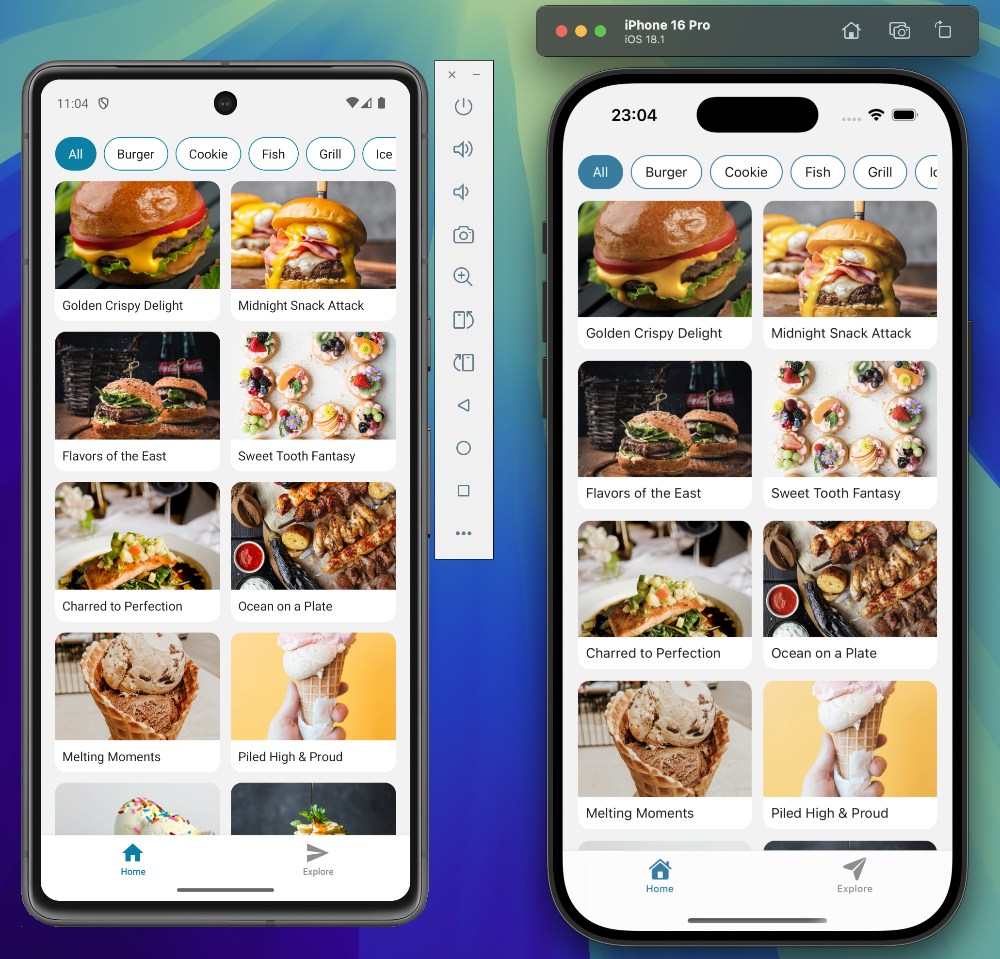
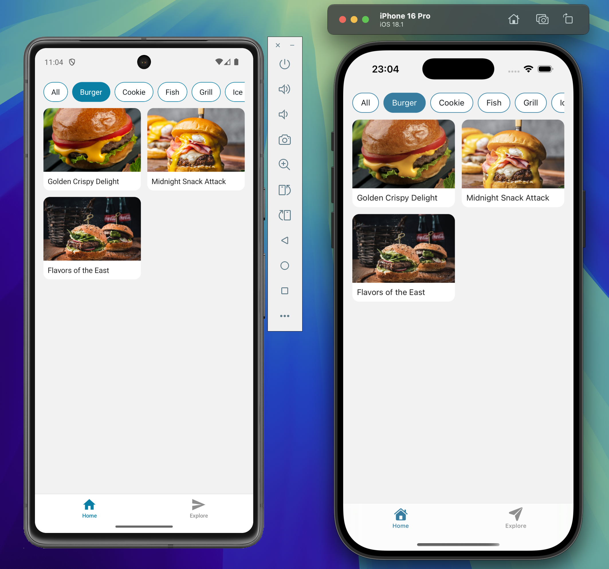
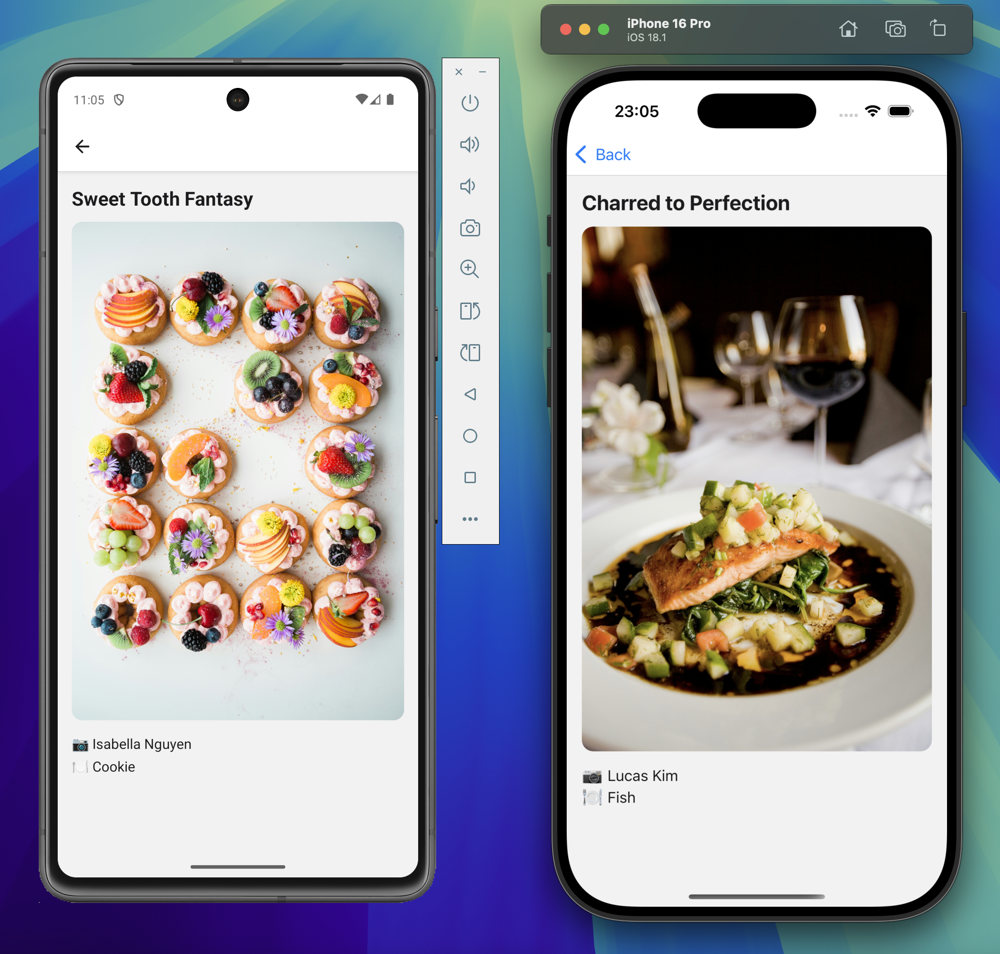
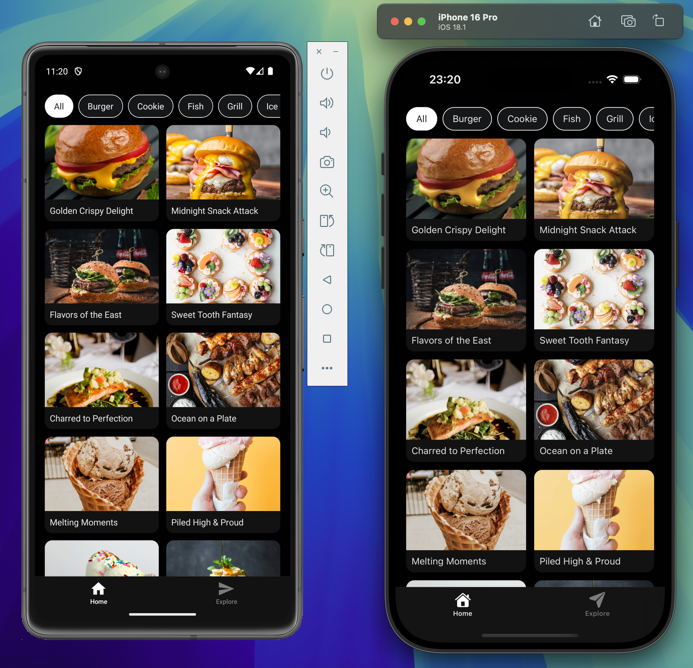
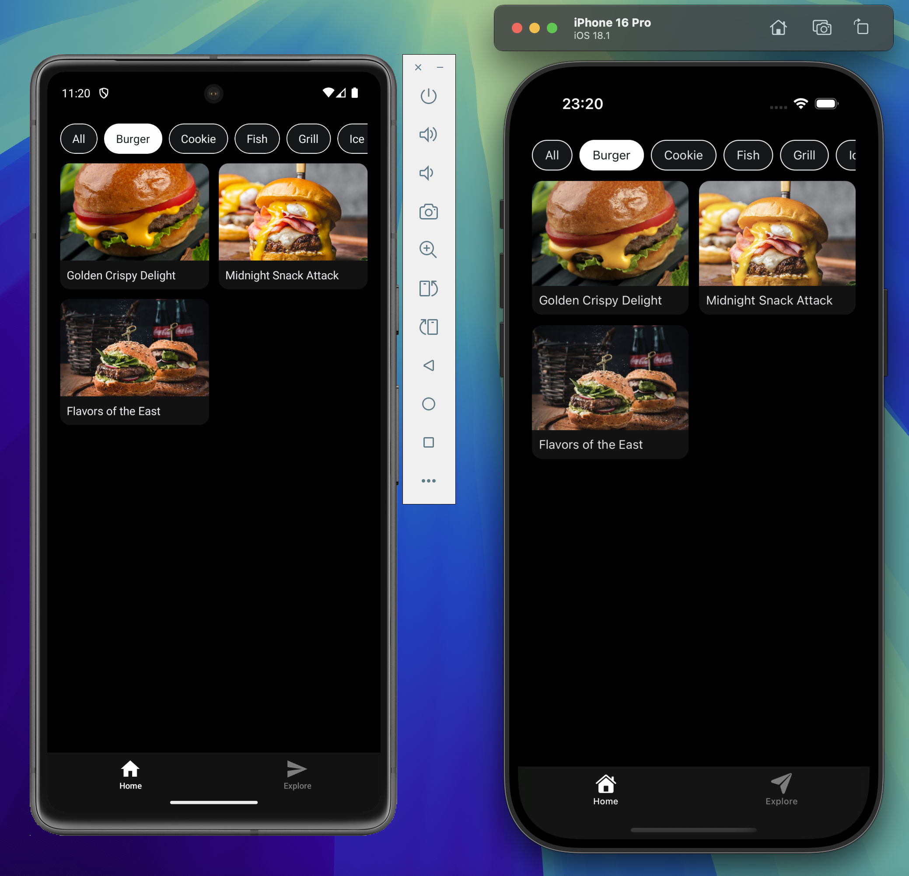
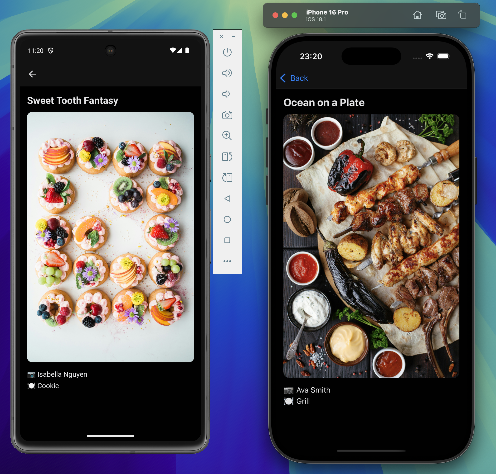

# 📸 Photo Viewer App — Full Stack Mobile Tech Experience (SDK 55)

A simple yet polished **photo viewer app** built with **React Native (Expo)** and **Ruby on Rails API**, designed to help users explore a gallery of food photography filtered by category.

---

## 📱 App Screenshots

### 🖼️ Light Mode

|  |  |  |
|---------------------------|---------------------------|---------------------------|

### 🌙 Dark Mode

|  |  |  |
|--------------------------|--------------------------|--------------------------|


## 🧠 Summary

### 📱 App Description
This mobile app allows users to browse high-quality food photos categorized by type (e.g., sushi, burger, pizza). Users can filter by category and tap on any photo to view more details like title and photographer.

### 💪 Strengths
- Full-stack: React Native frontend + Rails backend
- **Expo SDK 55** with React Native 0.83+
- **New Architecture** (Fabric/TurboModules) enabled by default
- Modern UI with dark/light theme
- Responsive image aspect ratio handling
- Modular code structure with hooks
- RESTful API with clean JSON responses

---

## ⚙️ Backend API Setup (`backend/`)

### 📦 Requirements
- Ruby 3.3+
- Rails 8+
- SQLite (default)
- Bundler

### 🔧 Installation Steps

```bash
cd backend
bundle install
bin/rails db:setup
```

This will:
- Create the database
- Run migrations
- Seed with food photos (title, category, photographer, image URL)

### 🚀 Run the Server
```bash
bin/rails server -b 0.0.0.0
```

The API will be available at:
```bash
http://<YOUR-IP>:3000/api/v1/photos
```

Use this IP in your mobile API code (e.g., usePhotos.ts):
```bash
axios.get('http://<YOUR-IP>:3000/api/v1/photos');
```

### 🌐 How to Get Your IP Address (for Expo access)
```bash
ipconfig getifaddr en0        # macOS
```

---

## ⚙️ Mobile App Setup (`mobile/`)

### 📦 Requirements

- **Node.js v22+ (LTS)** (Required for SDK 55 compatibility)
- **CocoaPods 1.15+** (iOS only)
- **Standard ASCII Paths**: Ensure project folder uses standard hyphens `-` instead of en-dashes `–` to avoid native build encoding errors.
- Expo CLI:
  ```bash
  npx expo
  ```

### 📦 Install dependencies

```bash
cd mobile/photo-viewer
npm install
```

### 🚀 Run the App

1. **Prebuild Native Files**:
   ```bash
   npx expo prebuild --clean
   ```

2. **Start the App**:
   ```bash
   npx expo start
   ```

3. **Run on Native**:
   ```bash
   npm run ios     # or npx expo run:ios
   npm run android # or npx expo run:android
   ```

> [!NOTE]
> This project uses the **New Architecture**. Initial builds may take longer as React Native core is compiled from source to resolve standard SDK 55 pod validation issues.
