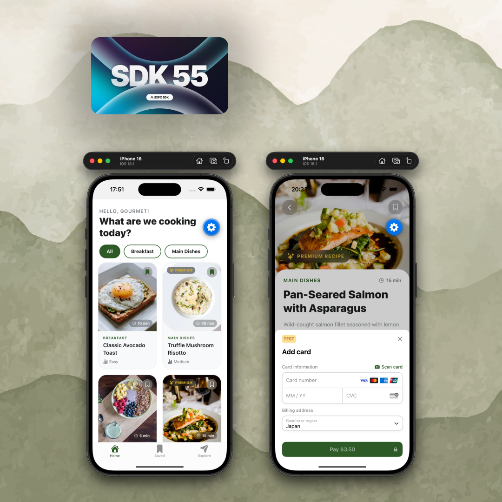

# 🥗 Forklore — Every dish tells a story.

Forklore is a premium recipe platform built with **React Native (Expo SDK 55)** and **Ruby on Rails 8**. It features a gourmet UI, premium content locking, and a full Stripe-powered checkout experience.

---

## 📱 App Screenshots



## 🚀 Stripe & Environment Setup

To enable payments and recipe unlocking, you must configure environment variables in both the backend and mobile directories.

### 1. 🔑 Get your Stripe Keys
1.  Go to the [Stripe Dashboard](https://dashboard.stripe.com/test/apikeys).
2.  Ensure you are in **Test Mode**.
3.  Copy your **Publishable key** (`pk_test_...`) and **Secret key** (`sk_test_...`).

### 2. 🏗️ Backend Setup (`backend/.env`)
Create a file named `.env` in the `backend/` directory:
```bash
STRIPE_SECRET_KEY=sk_test_your_secret_key_here
STRIPE_PUBLISHABLE_KEY=pk_test_your_publishable_key_here
```

### 3. 📱 Mobile Setup (`mobile/photo-viewer/.env`)
Create a file named `.env` in the `mobile/photo-viewer/` directory:
```bash
EXPO_PUBLIC_STRIPE_PUBLISHABLE_KEY=pk_test_your_publishable_key_here
EXPO_PUBLIC_API_URL=http://<YOUR-LOCAL-IP>:3000/api/v1
```
> [!IMPORTANT]
> Replace `<YOUR-LOCAL-IP>` with your actual machine IP (e.g., `192.168.1.5`) so the physical device/simulator can reach the Rails server.

---

## 🔄 Testing & Database Reset

### 🧪 How to Reset for Fresh Testing
If you want to clear your purchases and test the "Unlock" button again:
```bash
cd backend
bundle install
bundle exec rails db:seed
```
This wipes all orders and subscriptions, resetting the app to its default state.

### 🛠️ Manual Fulfillment (Developer Mock)
In local development, Stripe Webhooks won't reach your computer unless you use the Stripe CLI. We've implemented a **Seamless Mock** so you don't have to:
- The app automatically calls a "Confirmation" endpoint after a successful test payment.
- The backend marks the recipe as "Unlocked" immediately.

---

## 🛠️ Installation & Running

### Backend
```bash
cd backend
bundle install
bin/rails db:setup
bin/rails server -b 0.0.0.0
```

### Mobile
```bash
cd mobile/photo-viewer
npm install
npx expo prebuild --clean # Required for first setup
npx expo run:ios          # Run on iOS Simulator
```

---

## 🧠 Summary of Features
- **Premium Locking**: Recipes are hidden behind a paywall until purchased.
- **Go Pro**: Recurring \$9.99/mo subscription unlocks the entire catalog.
- **Optimistic UI**: Instructions appear the millisecond payment is confirmed.
- **Gourmet Design**: Dark/Light mode support with glassmorphism and premium badges.

---

## 🌐 Get Your Local IP
To find the IP for your `.env` file:
```bash
ipconfig getifaddr en0
```
